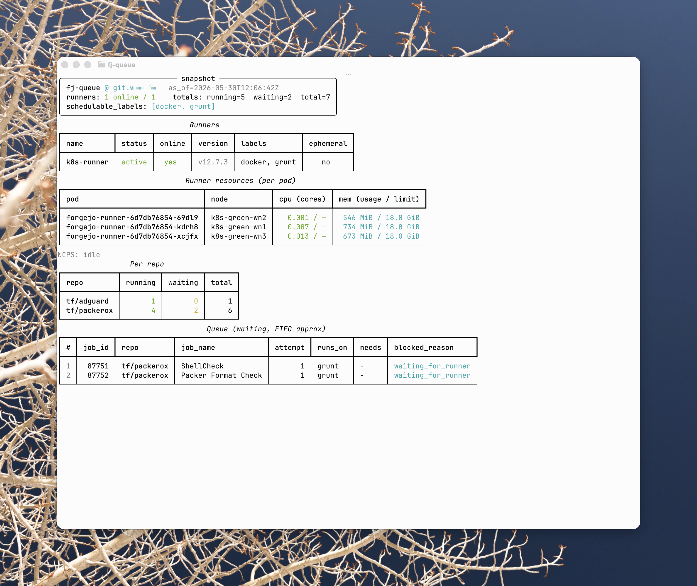

# fj-queue

A read-only Forgejo Actions runner and CI queue dashboard.

[](https://github.com/vtmocanu/fj-queue/actions/workflows/test.yml)
[](https://www.python.org/)
[](LICENSE)



Polls the Forgejo admin Actions API and renders runner inventory, queue totals,
per-repo backlog, a FIFO-approximate queue order, and structured warnings for
unschedulable jobs and possibly wedged workflow_call sentinels (forgejo#12127,
see [Caveats](docs/caveats.md#wedged-sentinel-detection-is-heuristic)).
Designed for two audiences:

- **Humans**: a live, in-place refreshing terminal UI (Rich) so an operator
  can see at a glance whether CI is saturated.
- **Agents**: a stable, byte-deterministic JSON document (`--format json`)
  backed by a committed JSON Schema, so scripts can branch on global
  saturation, a repo's queue position, and structured `blocked_reason` /
  `warnings` fields.

## Quick Start

Install with [Homebrew](https://brew.sh):

```bash
brew tap vtmocanu/tap
brew trust vtmocanu/tap    # Homebrew 6.0+ requires trusting third-party taps
brew install fj-queue
```

(On Homebrew older than 6.0, skip the `brew trust` line. `brew trust --formula vtmocanu/tap/fj-queue` scopes trust to just this formula.)

This pulls in `uv` and Python automatically. Then run:

```bash
# Single snapshot
fj-queue --host git.example.com

# Live dashboard (default at a TTY)
fj-queue --host git.example.com --mode watch

# Agent: JSON output piped to jq
fj-queue --host git.example.com --format json | jq '.totals'
```

Pass an **admin-scoped** Forgejo API token via `--token` or `$FORGEJO_TOKEN`.
A non-admin token exits 3.

Prefer running from a checkout without installing (`uv run fj_queue.py`)? See
[Installation](docs/installation.md).

For persistent settings, create `fj-queue.toml` in the current directory
(or `~/.config/fj-queue/config.toml`):

```toml
host = "git.example.com"

# Metrics and NCPS are OFF by default.
# Uncomment and supply a Prometheus URL to enable them.
# [metrics]
# enabled = true
# url = "https://prometheus.example.com"
# namespace = "ci-runners"
```

See [`config.toml.example`](config.toml.example) for the full format with
all supported keys.

## Documentation

| Document | Contents |
|---|---|
| [Installation](docs/installation.md) | Requirements, uv, token setup |
| [Configuration](docs/configuration.md) | Flags, env vars, config file, precedence, discovery |
| [Usage](docs/usage.md) | Formats, modes, filtering, exit codes, examples |
| [JSON contract](docs/json-contract.md) | Schema shape, ordering, stability guarantees |
| [Metrics and NCPS](docs/metrics-ncps.md) | Per-pod CPU/memory and NCPS cache status (opt-in) |
| [Caveats](docs/caveats.md) | FIFO approximation, blocked jobs, filter scope |

See also: [Homelab Adventures: fj-queue](https://hai.wxs.ro/custom-tools/fj-queue/) for the background and design notes.
